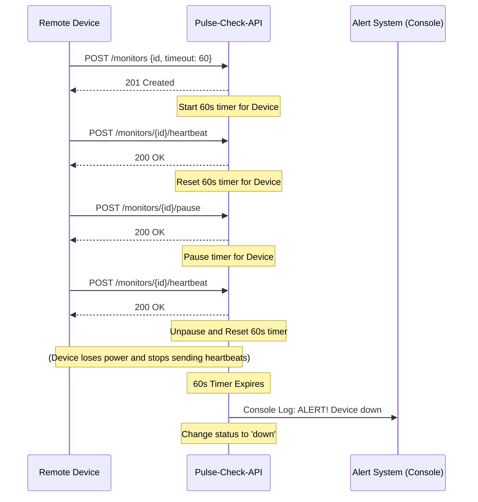

# Pulse-Check-API ("Watchdog" Sentinel)

CritMon Pulse-Check-API is a "Dead Man's Switch" API designed for remote monitoring of critical infrastructure like solar farms and weather stations. Devices register a monitor with a countdown timer and must send periodic heartbeats to prevent an alert from firing.

## Architecture Diagram

The system uses a simple in-memory stateful timer management system. When a device registers or sends a heartbeat, the server initiates or resets a countdown timer. If the countdown expires without receiving a heartbeat, an alert is triggered (simulated via console log).



## Setup Instructions

1. **Prerequisites:** Make sure you have Node.js (v14 or higher) installed.
2. **Change directory**Make sure to change directory into the Pulse-Check-API before you start
  ```bash
   cd  .\Pulse-Check-API
   ```

2. **Installation:** Run the following command to install the necessary dependencies:
   ```bash
   npm install
   ```
3. **Start the Server:** Start the API server using npm:
   ```bash
   npm start
   ```

   The server will run on `http://localhost:3000` by default.

## API Documentation

> **Note for Postman Users:** 
> If you are using Postman to test this API, make sure to set your request body type to **raw** and select **JSON**. 
> You need to enter the following fields as parameters in the JSON body for the Registration endpoint:
> - `id` (String)
> - `timeout` (Number)
> - `alert_email` (String)

### 1. Register a Monitor
Create a new monitor with a specific timeout duration.

*   **Endpoint:** `POST /monitors`
*   **Request Body:**
    ```json
    {
      "id": "device-123",
      "timeout": 60,
      "alert_email": "admin@critmon.com"
    }
    ```
    *Note: `timeout` is in seconds.*
*   **Response (201 Created):**
    ```json
    {
      "message": "Monitor created successfully",
      "monitor": {
        "id": "device-123",
        "timeout": 60,
        "alertEmail": "admin@critmon.com",
        "status": "ok",
        "timeRemaining": 60
      }
    }
    ```

### 2. The Heartbeat (Reset)
Send a signal to the server to reset the countdown timer. If the monitor was previously paused, this un-pauses it.

*   **Endpoint:** `POST /monitors/{id}/heartbeat`
*   **Response (200 OK):**
    ```json
    {
      "message": "Heartbeat received",
      "monitor": {
        "id": "device-123",
        "timeout": 60,
        "alertEmail": "admin@critmon.com",
        "status": "ok",
        "timeRemaining": 60
      }
    }
    ```

### 3. The "Snooze" Button (Pause)
Pause monitoring while repairing a device to prevent false alarms. The timer stops completely and no alerts will fire.

*   **Endpoint:** `POST /monitors/{id}/pause`
*   **Response (200 OK):**
    ```json
    {
      "message": "Monitor paused successfully",
      "monitor": {
        "id": "device-123",
        "timeout": 60,
        "alertEmail": "admin@critmon.com",
        "status": "paused",
        "timeRemaining": 0
      }
    }
    ```

## The Developer's Choice: Observability Endpoints
**Feature added:** Status retrieval endpoints.
*   `GET /monitors` - Lists all registered monitors.
*   `GET /monitors/{id}` - Gets the current status of a specific monitor.

**Why I added it:**
A "Dead Man's Switch" API acts behind the scenes, but system administrators and support engineers need observability. They need to proactively check the health of all devices or query a specific device to see how much time is remaining before an alert triggers. This feature makes the system more robust by offering a unified dashboard view without needing to wait for an alert to fire.

### Example: Get all monitors
*   **Endpoint:** `GET /monitors`
*   **Response (200 OK):**
    ```json
    [
      {
        "id": "device-123",
        "timeout": 60,
        "alertEmail": "admin@critmon.com",
        "status": "ok",
        "timeRemaining": 42
      }
    ]
    ```
